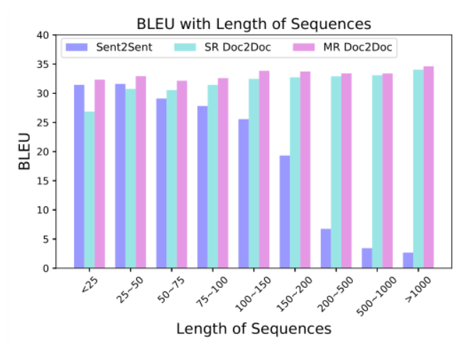
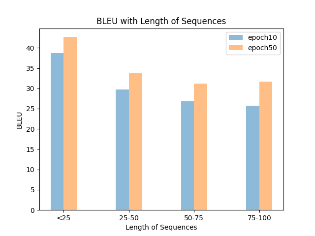

# jjyaoao 的文本工具箱

> 特别鸣谢: https://github.com/MiuGod0126

[TOC]

下载并安装依赖:

```bash
git clone git@github.com:jjyaoao/jjyaoao_tools.git
# 设置环境变量
export TOOLS=$PWD/
cd jjyaoao_tools/nmt_data_tools
# pip install -r requirements.txt
python -m pip install -r requirements.txt -i http://pypi.douban.com/simple/ --trusted-host pypi.douban.com
```

### 1.多进程分词

支持：

1. 中、泰多进程分词

2. 中：jieba、thulac、ltp，速度如下（10w句，AMD EPYC 7601cpu10核并行）

   注意：ltp使用了torch模型，速度较慢，不建议用来分词；若要用则用cut.py而非cut.sh,因为ltp自带了多核优化。

   | jieba | thulac  | ltp   |
   | ----- | ------- | ----- |
   | 4.08s | 16.572s | 1h+.. |

3. data/userwords.txt从[THUOCL：清华大学开放中文词库](http://thuocl.thunlp.org/)提取11类共22w中文词，可以作为用户定义词典提高分词的精度。

```shell
# bash my_tools/cut.sh <workers> <infile> <outfile>
# 可选参数：<lang> <backend> <userdict>
# lang=zh/th, backend=jieba/thulac(chinese segment) 
# userdict： 用户定义词典，一行一个词

# exp1: “那么我们都可以在这个平台上面可以拿到它所有源代码去加以运用。”
# zh-jieba speed=2.42
bash my_tools/cut.sh 4 data/train.zh data/train.tok.zh 
# zh-thulac speed=3.67s
bash my_tools/cut.sh 4 data/train.zh data/train.tok.zh zh thulac
# jieba-res: 那么 我们 都 可以 在 这个 平台 上面 可以 拿到 它 所有 源代码 去 加以 运用 。
# thulac-res: 那 么 我们 都 可以 在 这个 平台 上面 可以 拿 到 它 所有 源 代码 去 加以 运用 。

# exp3: ltp默认带了多核优化，若再用shell开多进程会被kill
python my_tools/cut.py 4 data/train.zh data/train.tok.zh ltp

# exp4: 用户词典
bash my_tools/cut.sh 4 data/train.zh data/train.tok.zh zh thulac data/userwords.txt

# exp5: "ผม/ฉันมาจากสหรัฐอเมริกา"
# th-pythainlp
bash my_tools/cut.sh 4 data/train.zh data/train.tok.zh th
# res: ผม / ฉัน มาจาก สหรัฐอเมริกา
```


### 2.词表转换

json->vocab(paddle)->dict(fairseq)


**新增： 多进程获取词典，速度快了2倍多。 22/9/13**

```shell
# 单进程
python my_tools/build_dictionary.py $infile
# 多进程
bash my_tools/build_dictionary_paral.sh $workers $infile
# 输出：infile.json

#eg:  wiki.train.tokens, 1801350 lines
time python my_tools/build_dictionary.py wiki.train.tokens
# real    0m40.372s
time bash my_tools/build_dictionary_paral.sh 4 wiki.train.tokens
#real    0m18.201s
```

**1. json2dict，不再需要从 vocab 中转，且能保留词频信息。**

**2.json2vocab 和 json2dict 加入 min_freq，参数，支持按照频率过滤词表。**

```bash
# 1.json 转 paddle vocab
#python my_tools/json2vocab.py $infile $outfile $min_freq(optional)
python my_tools/json2vocab.py data/train.bpe.zh.json data/vocab.zh


# 2.json 转 fairseq dict
#python my_tools/json2dict.py $infile $outfile $min_freq(optional)
python my_tools/json2dict.py data/train.bpe.zh.json data/dict1.zh.txt

# 3.paddle vocab 转 fairseq dict
# python my_tools/vocab2dict.py $infile $outfile $min_freq(optional)
python my_tools/vocab2dict.py data/vocab.zh data/dict.zh.txt

# 4.fairseq dict 转  paddle vocab
# python my_tools/dict2vocab.py $infile $outfile
python my_tools/dict2vocab.py data/dict.zh.txt data/vocab.zh
```

```bash
# 数据类型一览:
train.bpe.zh.json
"<EOS>": 0,
"<GO>": 1,

vocab.zh
<GO>
<UNK>
的

dict.zh.txt
。 100000
， 99999
&quot; 99998

dict1.zh.txt
, 4
。 5
， 6
```

### 3.文本过滤

1.**⭐ 语言标识过滤**

使用 fasttext

```bash
# 1.下载权重（放nmt_data_tools目录下）
wget https://dl.fbaipublicfiles.com/fasttext/supervised-models/lid.176.bin
# 2.过滤平行语料
python ./my_tools/data_filter.py --src-lang $SRC --tgt-lang $TRG --in-prefix data/train --out-prefix data/trainlang --threshold 0.5

# 3.example
python ./my_tools/data_filter.py --src-lang zh --tgt-lang en --in-prefix data/train --out-prefix data/trainlang --threshold 0.1
# result: lang id filter| [967/1000] samples retained, [33/1000] were deleted.
```

```bash
# 有时句子里会掺入其他语言的词汇（比如：“Today天气real不错”），语言标识过滤用fasttext识别src和tgt的语言id，若任一边不符合原来的id，则删除这对语料。

# fasttext使用案例
import fasttext
model_path="lid.176.bin"
model=fasttext.load_model(model_path)
labels,scores=model.predict(["今天天气真不错","Today天气real不错"])
print(labels,scores)

[['__label__zh'], ['__label__en']] [array([0.99306196], dtype=float32), array([0.32698047], dtype=float32)]
# 可以看到当句子较短时，仅掺两个英文词汇便被认为是英文__label__en，这样"Today天气real不错"所在的语料对会被过滤掉。除了看__label__zh是否正确，还可以考虑置信度高低，如label正确，但置信度0.4<threshod=0.5也可以过滤掉（可以设低点）

```

**2.长度过滤**

替代 moses 的 clean-corpus，打印统计信息。

```bash
# 长度检测 (用于tokenize后，bpe前)
# python my_tools/check_pair.py <in_prefix> <SRC> <TRG>  <upper> <ratio> <write_trash>(0/1)
python my_tools/check_pair.py data/train.tok zh th  175 1.5 0
# 默认write_trash=0，只打印，不写trash；0时会把范围外的异常数据写入 <inprefix.trash.lang>

# 长度过滤 (替代moses的clean-corpus；一般用于bpe之前)
# 有些明显长度不匹配的能过滤掉，比如一个3个词，另一边30个
#（1-250，比例1:2.5或2.5:1）,长度过滤往往丢的数据最多，多手下留情哈。
python my_tools/length_filter.py --src-lang zh --tgt-lang th --in-prefix  data/train.bpe --out-prefix data/train.clean --low 1 --up 200 --ratio 1.5 --remove-bpe --wt
# --remove-bpe可选，开启后判断长度时删掉@@ ，不影响写入； --wt可选，效果同check_pair的write_trash
```

```bash
check 结果：
              ratio       src_len       tgt_len
count  1.503344e+06  1.503344e+06  1.503344e+06
mean   1.613559e+00  7.379560e+00  8.033880e+00
std    9.832292e-01  5.450975e+00  5.950167e+00
min    1.000000e+00  1.000000e+00  1.000000e+00
25%    1.142857e+00  4.000000e+00  5.000000e+00
50%    1.333333e+00  6.000000e+00  7.000000e+00
75%    1.714286e+00  9.000000e+00  1.000000e+01
max    8.500000e+01  5.100000e+02  5.010000e+02
84 lines len > 175, 65409 lines ratio > 3.0.
step info: {'1.5': 494654, '2': 194131, '2.5': 118475, '3': 65409}
```

### 4.批量提取 xml 和 sgm

#### 4.1 提取单个 xml：

```bash
# 1.command:
python my_tools/process_xml.py $infile $outfolder

# 2.example:
python my_tools/process_xml.py data/xml/bgzh/val.bg-zh.bg.xml data/
# result:
#total 1000 lines.
#write to data/val.bg-zh.bg.txt success.
```

```bash
<seg id="1">Можем да приключваме.</seg>
<seg id="2">Няма да ни липсваш.</seg>
<seg id="3">Свикнал е да изнася лекции.</seg>
=====》
Можем да приключваме.
Няма да ни липсваш.
Свикнал е да изнася лекции.
```

#### 4.2 ⭐ 提取含 xml 的文件夹

```bash
# 1.command:
bash my_tools/process_xml_folder.sh <infolder> <outfolder>

# 2.example:
bash my_tools/process_xml_folder.sh data/xml/ xml_out
```

```bash
############### input ############### ：
data/xml
├── bgzh
│   ├── val.bg-zh.bg.xml
│   └── val.bg-zh.zh.xml
└── ruzh
    ├── val.ru-zh.ru.xml
    └── val.ru-zh.zh.xm
############### output ############### ：
xml_out/
├── bgzh
│   ├── val.bg-zh.bg.txt
│   └── val.bg-zh.zh.txt
└── ruzh
    ├── val.ru-zh.ru.txt
    └── val.ru-zh.zh.txt
```

### 5.⭐ 写入 xml：

```bash
# 1.生成xml
python my_tools/write_xml.py data/train.en data/result.xml
```

```bash
# input:  So this is our last stop, and we came back to our headquarter in Beijing.
# output:
<tstset setid="nestest2019" srclang="zh" trglang="en">
  <DOC docid="news" sysid="1">
    <p>
      <seg id="1">So this is our last stop, and we came back to our headquarter in Beijing.</seg

# 2.再在xml开头添加
<?xml version="1.0" encoding="UTF-8"?>
# 即是标准的xml文件
```

### 6.流式输入处理

```bash
# 1.command:
python my_tools/stream_preprocess.py <infile> <outfile> <1(towhole)|2(tostream)> <lang>

# 2.example:
# 流式->整句（data/whole.zh）
python my_tools/stream_preprocess.py data/stream.zh data/whole.zh 1 zh
# 整句->流式（data/stream2.zh）
python my_tools/stream_preprocess.py data/whole.zh data/stream2.zh 2 zh
```

```bash
如：
大
大家
大家晚         <=========> 	大家晚上好
大家晚上
大家晚上好
```

### 7.合并、拆分语料

#### 7.1 合并

```bash
# 1.python
# python {sys.argv[0]} <infile1> <infile2> <outfile> <sep> (space/tab)
# 空格分隔
python my_tools/merge.py data/train.zh data/train.en data/outfile.txt space
# 制表符分割
python my_tools/merge.py data/train.zh data/train.en data/outfile.txt tab

# 2.shell
paste data/train.zh data/train.en > data/outfile.txt
# paste -d ' ' 空格分割不好用，paste -d默认参数是\t
```

#### 7.2 拆分

```bash
# src
cut -f 1 data/outfile.txt > data/cut.zh
# tgt
cut -f 2 data/outfile.txt > data/cut.en
```

> 合并拆分均是指交叉语料，例如中英交叉合并，中英交叉拆分

### 8.数据划分

划分训练和验证集

```bash
# 1.command:
python my_tools/train_dev_split.py <src-lang> <tgt-lang> <inprefix> <outfolder> <dev len>

# 2.example:
python my_tools/train_dev_split.py zh en data/train data 500
# 从train中随机取500条到data/dev.zh/en，其余的data/train.zh/en,result:
# dev为验证集
write to data\train.zh success.
write to data\train.en success.
write to data\dev.zh success.
write to data\dev.en success.
```

### 9.上、下采样

#### 9.1 上采样

```bash
# 1.command:
python my_tools/upsample.py <src-lang> <tgt-lang> <inprefix> <outfolder> <upsample len>

# 2.example:
# train为文件名，zh、en为文件后缀
# 将不够的语句不断随机刷新凑够10000
python my_tools/upsample.py zh en data/train data 10000
# result:
write to data\upsample.zh success.
write to data\upsample.en success.
```

#### 9.2 下采样

直接使用上文**8.数据划分**，取 dev.lang 作为下采样结果

### 10.打乱平行语料

新增：可以直接使用shell命令`shuf`进行打乱，对大文件非常友好。

```shell
seed=1
shuf --random-source=<(yes $seed) train.src > train.shuf.src
shuf --random-source=<(yes $seed) train.src > train.shuf.tgt
```

或者合并文件后shuf，再拆分： 注：paste的分隔符d只能用一个字符，多个字符拼接使用该命令：paste -d '@@@' file1 /dev/null /dev/null file2

```shell
paste -d '@@@' train.src /dev/null /dev/null train.tgt | shuf > train.all
# 取第1列
cat train.all | awk -F'@@@' '{print $1}' > train.src 
cat train.all | awk -F'@@@' '{print $2}' > train.tgt 
```

```bash
# 1.command:
python my_tools/shuffle_pair.py <src_lang> <tgt_lang> <data_prefix> <out_folder>

# 2.example:
python my_tools/shuffle_pair.py zh en data/train data/
# result:
write to data/shuffle.zh success.
write to data/shuffle.en success.
```

### 11.去重

**新增：从语料1中，删除语料2中的数据：**

```shell
# python my_tools/drop_specific_pairs.py <src_lang> <tgt_lang> <main_prefix> <drop_prefix>  <workers>
# 从main_prefix.lang中删除drop_prefix.lang中的数据，写入到main_prefix.drop.lang

# eg:
python my_tools/drop_specific_pairs.py zh en data/train data/dev 4

#Corpus pair to be deleted: [493] pairs.
#500it [00:00, 4761.99it/s]
#Delete the specified language is complete! Total [0/500] paris.

# 其中train和dev数据相同，所以train全被删了，结果train.drop.lang为空
```

双语去重。（无序，比有序快 25%）

```bash
# python my_tools/deduplicate_pairs.py  <in_prefix> <src_lang> <tgt_lang>  <workers>
# 会默认写到in_prefix.dedup.lang里,example:
python my_tools/deduplicate_pairs.py  data/train zh en  4
# 文件名train.dedip.zh/en
```

单语多文件去重 。（无序）

```bash
# 1.command:
python my_tools/deduplicate_lines.py --workers $workers files > $outfile

# 2.example:
python my_tools/deduplicate_lines.py --workers 4 data/upsample.zh > data/dedup.zh
wc data/dedup.zh
# 行数为493、单词数499、字节数47809  data/dedup.zh
```

### 12.⭐ 翻译数据处理

以 zh en 为例进行数据处理：

(未完成，后续魔改)

```bash
bash preprocess.sh
```

### 13.后处理

对英文 detokenize+detruecase

```bash
# bash postprocess.sh <prefix>
bash postprocess.sh data/zhen_bpe/train.bpe
```

### 14.fast_align 抽取词典

可以直接或间接从MUSE获取词典，见18。

注：linux环境，可在aistudio运行。

```shell
# 1.分词
bash my_tools/cut.sh 4 data/train.zh data/train.tok.zh
bash my_tools/cut.sh 4 data/dev.zh data/dev.tok.zh
mv data/train.tok.zh data/train.zh
mv data/dev.tok.zh data/valid.zh

# 2.fast align 对齐 （data/fast_align/dict.zh-en）
# bash my_tools/fast_align_dict.sh <src> <tgt> <infolder> <outfolder> <topk>
bash my_tools/fast_align_dict.sh zh en data/ align_output/ 1000
# result
head align_output//dict.zh-en
我们    we      74
的      of      50
一个    a       48
是      is      44

# 3.抽取词典(可使用停用词过滤、语言标识过滤)
# python my_tools/dict_filter.py <src_lang> <tgt_lang> <in_file> <out_file> <src_stop_file>(optional) <tgt_stop_file>(optional) <model_path>(optional)
# src_stop_file和tgt_stop_file是停用词文件，model_path是fasttext的模型权重路径，两个都是可选参数
# 3.1简易抽取（去除1:m,m:1,m:n的对应）
python my_tools/dict_filter.py  zh en  align_output/dict.zh-en align_output/dict.zh-en.txt  

# result
head -n 10 align_output/dict.zh-en.txt
我们    we      74
的      of      50
是      is      44
可以    can     41


# 3.2去除停用词、语言标识过滤(中英为例子)
git clone https://github.com/goto456/stopwords.git
git clone https://github.com/stopwords-iso/stopwords-en.git
# fast-text weight
wget https://dl.fbaipublicfiles.com/fasttext/supervised-models/lid.176.bin

python my_tools/dict_filter.py  zh  en  align_output/dict.zh-en align_output/dict.zh-en.txt  stopwords/cn_stopwords.txt stopwords-en/stopwords-en.txt lid.176.bin

# result
机器人  robot   17
语音    voice   15
开发者  developers      12
用户    user    12

# 4.其他停用词
stop words:
    zh: https://github.com/goto456/stopwords.git            stopwords/cn_stopwords.txt
    en: https://github.com/stopwords-iso/stopwords-en.git   stopwords-en/stopwords-en.txt
    de: https://github.com/stopwords-iso/stopwords-de.git
    fr: https://github.com/stopwords-iso/stopwords-fr
    es: https://github.com/stopwords-iso/stopwords-es.git
    vi: https://github.com/stopwords/vietnamese-stopwords.git
    ru: https://github.com/stopwords-iso/stopwords-ru
```

目前已经可以抽取词典，后续准备添加停用词过滤，然后清洗词典，或者检测并保留些实体词，就不放在抽取词典上了。

### 15.随机对齐替换(RAS)

随机对齐替换。用词典将 source 的词典词按一定几率替换为其他语言的同义词。

```bash
python my_tools/replace_word_bilingual.py --langs de;en --dict-path dic --data-path data  --prefix train --num-repeat 1 --moses-detok --replace-prob 0.3 --vocab-size 1000

tree:
/dic
	de-en.txt # de_word en_word \n (空格分隔)
/data
	train.src # <lang_id> src_text
	train.tgt # <lang_id> tgt_text
```

**完整文档和demo参考[ras_sample](https://github.com/jiaohuix/nmt_data_tools/blob/main/examples/ras_sample/README.md)**

### 16.⭐ 罕见词、乱码过滤（中文）

1.对于部分乱码，编码成 gbk 后会报错，如此可以剔除一部分：

```python
def check_is_encode_error(string):
    try:
        string.encode('gbk')
    except UnicodeEncodeError:
        return True
    return False
# eg：s="硂或ㄓ и籔羆琌畉˙ぇ换"
# print(check_is_encode_error(s)) # True
```

2.对于不会报错的罕见词，可以在文本进行分词后用 unicode 编码区分中文和其他字符，大多数情况是符号或者日语，所以用日语的 unicode 来区分是不是正常的词。

```python
def is_all_japanese(strs):
    for _char in strs:
        if not '\u0800' <= _char <= '\u4e00':
            return False
    return True

# 如得到下面奇怪的词表：
'''
['ㄛ', '①', '⼈', '┅', '◎', '●', 'ㄧ', '〈', '〖', '≥', '②', '\u200b', '•', '⼀', 'ㄓ', '〇', 'ㄚ', '③', '⻔', '⼝', 'Ⅲ', '④', '⑤', '│', '∩', 'ぃ', '⼦', 'ส', '์', 'ร', 'ぎ', '㖊', 'ㄩ', '≤', '⾕', 'ぐ', '⊿', 'Ⅳ', 'ย', '⾯', 'ヶ', '∣', 'ㄤ', '⊙', '▲', 'ㄍ', 'ㄞ', '⾃', '⾮', '※', 'จ', 'す', 'れ', '✘', 'レ', '⼩', 'ㄈ', 'ิ', '⽤', '⑦', '⑥', '❤', 'ㄇ', 'ㄐ', '⽽', 'ㄘ', 'ㄗ', '⼴', '⼊', '‰', '⼼', '⼯', '▓', '┕', '⾛', '〜', '䴕', 'Ⅵ', '⽣', 'い', 'น', 'ゅ', 'え', 'ㄅ', 'ㄎ', '∕', '㎡', 'ㄥ', 'わ', 'Ⅴ', '✔', 'ไ', 'พ', 'ค', 'ต', 'ม', 'า', 'อ', 'ซ', 'เ', '㖞', '⽿', '⽶', '⻄', '⽬', '⽂', 'ฮ', 'ว', 'ง', 'ุ', '้', 'が', 'ば', 'ヴ', 'か', '╩', '㓥', '㎝', '═', 'オ', '㈱', '┣', '⑩', 'ㄖ', 'ㄌ', 'ㄆ', 'ボ', 'ヘ', 'も', 'デ', 'ㄨ', 'ㄉ', 'ㄠ', 'ァ', 'む', 'ェ', 'ゴ', '√', '⽞', '⼜', '⾜', 'Ⅷ', 'Ⅶ', '∨', '≠', '⻅', '⾄', '∪', 'Ⅸ', 'ะ', 'ื', 'ั', 'ท', 'ี', '่', '⑧', 'ㄙ', '⼤', 'ト', 'ッ', 'プ', 'グ', 'イ', 'ン', 'を', '⾸', '⺟', '⾏', '・', '⽉', '⽴', 'ㄒ', 'ㄢ', 'の', 'ど', 'こ', 'ん', 'に', 'ち', '╰', '╭', '″', 'せ']
'''
```

找出含这些词的句子，这部分句子有很大概率是无意义的句子（全是乱码），也有可能只是包含些特殊符号，我们对这些嫌疑句进行打分，规则如下：

si=(w1,w2,...,wn)

$$ Score(i)=\frac{1}{n}\sum*{k=0}^{k=n}I(freq*{k}<100)\* \frac{（100-freq\_{k})}{100} $$ 

对于第 i 个句子 si，有 n 个 word。句子分数 Score(i)为，n 个 word 的分数求平均。指示函数 I 当词频小于 100 时为 1， 对于词频 freq>100 的词，分数为 0；对于 freq<100 的词，分数为归一化的 100-freq，这样词频低就分数高；若乱码多，基本上分数很容易超过 0.5,俺把超过 0.45 的都当初乱码丢掉了。对于 score<0.45 的嫌疑句，俺按规则删掉些乱码词后放回原语料。

```python
# python my_tools/zh_abnormal_filter.py --zh-lang zh --other-lang th --in-prefix data_zhth/train.tok --out-prefix data_zhth/train.clean --threshold 0.45 --min-freq 20 --wt
# 用在tokenize之后，bpe前
# --wt可选，加了后会把嫌疑句存到out_prefix.update.zh 和out_prefix.trash.zh
'''
update: (score<0.45)

Score: [0.140], Sentence: [◎ 我 都 会 等 你
]Score: [0.213], Sentence: [◎ 在 那些 我 无法 忘怀 的
]Score: [0.210], Sentence: [◎ 所有 熟悉 的
]Score: [0.280], Sentence: [◎ 老 地方
]Score: [0.210], Sentence: [◎ 等 着 你

trash: (score>0.45)

Score: [0.829], Sentence: [※ 涴 汊 唒 ＃ § 庈 部 塑 毽 斯 剟 覂 ※ 扥 酗 盛 赽 わ 晒 赵塑 §
]Score: [0.475], Sentence: [395 ) 若 吾 起舞 吾 が 舞 え ば
]Score: [0.790], Sentence: [惕 К - 凌 岆 勤祥 れ
]Score: [0.784], Sentence: [膻寿 炵 ㄛ 梗 温 婓 陑 奻
]Score: [0.741], Sentence: [辣 茩 蝠 霜 ﹛ QQ ㄩ 31946467
]Score: [0.823], Sentence: [祥 岆 珨 跺 艘 善 か 谣艺 羹 憩霜谙 厄腔 伎 寤 橾 啄
'''
```

### 17.ngram语言模型

> 处理几句相似但存在错误的句子(ocr输出)

```shell
# eg1: 昨天早上扔垃圾的时候\t昨天早上扔圾的时候\t咋天早上扔垃圾的时候
```

- 我尝试使用以word为单位的ngram模型为句子打分,效果较差,原因是词粒度太大, 打分时容易出现OOV的词,如词表有"雨伞",而要为"我 去 拿 伞" 和 "我 去 拿 平" 两句句子打分时, 因为"伞" 不单独出现在词表, 所以分数一样
- 最后我用以char为单位的ngram模型对句子进行打分, 缓解了OOV的问题, 并且句子得分很合理,见以下demo:
- TODO: 1.添加用新语料**更新模型**的功能, 将从新的领域语料得到的ngram的count提高, 从而让得分对领域词更敏感. 2. 以候选句中得分最高的为模板, 找到错误后替换为别的句子中对应词, 取得分高的从而达到**纠错**的效果.

使用如下：

```python
from my_tools.ngram_char import nGramChar
# build model
model = nGramChar(n_gram=3)
# train model
model.train_ngram(text_file="cnews/cnews.test.txt")
# save model
model.save_model(path="./")
# load model
model.load_model(path="./")
# score
s1 = '他似乎总是缺乏一位掌门人应有的清晰思路和价值判断'
s2 = '他似夫总似缺乏一位掌门人应有的清晰思路和价紫判断'
prob1 = model.sentence_logprob(sentence=s1)
prob2 = model.sentence_logprob(sentence=s2)
print(f"Sentence: {s1}, Score: {prob1}")
print(f"Sentence: {s2}, Score: {prob2}")
'''
Sentence: 他似乎总是缺乏一位掌门人应有的清晰思路和价值判断, Score: -4.171
Sentence: 他似夫总似缺乏一位掌门人应有的清晰思路和价紫判断, Score: -10.397
'''
```

打分结果：

```python
# eg1: 昨天早上扔垃圾的时候\t昨天早上扔圾的时候\t咋天早上扔垃圾的时候
'''
Sentence: 昨天早上扔垃圾的时候, Score: -12.5425 √
Sentence: 昨天早上扔圾的时候, Score: -13.5297
Sentence: 咋天早上扔垃圾的时候, Score: -14.132
'''
# eg2: 
'''
 Sentence: 他似乎总是缺乏一位掌门人应有的清晰思路和价值判断, Score: -4.171 √
 Sentence: 他似夫总似缺乏一位掌门人应有的清晰思路和价紫判断, Score: -10.397
'''
# eg3:
'''
Sentence: 被送到医院后确认死亡, Score: -10.2888 √
Sentence: 破送到医院后确认死亡, Score: -12.5591
'''
```

### 18. MUSE多语言词典

说明： muse的词典是x-en.txt的，以英文为中心，本节利用lang1-en.txt和lang2-en.txt 两个到英文的词典，获取lang1-lang2.txt的词典。

```shell
# eg：获取俄中词典
## 1. 下载俄英，中英词典
wget https://dl.fbaipublicfiles.com/arrival/dictionaries/ru-en.txt
wget https://dl.fbaipublicfiles.com/arrival/dictionaries/zh-en.txt

## 2.转俄中
python my_tools/get_pivot_dict.py ru-en.txt zh-en.txt
# write to ./ru-zh.txt success, total 13852 lines.
```

### 19.Annoy加速相似向量查找

对于635965x300的词表，构建索引需要26秒，而查找只需1毫秒左右。

参考：https://mp.weixin.qq.com/s/clqJhvk-HJnYsTh9tg2VAw

```python
from my_tools.annoy_indexer import AnnoyIndexer
# 1.get weight
from paddlenlp.embeddings import TokenEmbedding
token_embedding = TokenEmbedding(embedding_name="w2v.baidu_encyclopedia.target.word-word.dim300")
weight = token_embedding.weight.numpy()

# 2.build ann tree
vocab_size = len(token_embedding.vocab)
indices = list(range(vocab_size))
tokens= token_embedding.vocab.to_tokens(indices)
print(tokens[:10])

print("build annoy indexer...")
indexer = AnnoyIndexer(tokens,weight,num_trees=10)
indexer.build_indexer()

# 3. save params
print("save annoy indexer...")
indexer.save(path="save")

# 4.load indexer
print("load annoy indexer...")
indexer_new = AnnoyIndexer()
indexer_new.load(path="save")
print(indexer_new)
print(len(indexer_new))

# 5.search sim word
print("search sim words ...")
word = "电影"
# word = "国王"

# idx = indexer_new.token2idx(word)
vec = indexer_new.search_vector(word)
topk=5
ids, distances = indexer_new.most_similar(vec,topk)
nearest_tokens = [indexer_new.idx2token(idx) for idx in ids]
print(f"{word}'s {topk} nearest_tokens",nearest_tokens)
# 电影's 5 nearest_tokens ['电影', '影片', '电视剧', '影视作品', '导演']
# 国王's 5 nearest_tokens ['国王', '雅赫摩斯', '雨果·卡佩', '塞利姆', '法王路易']
```

### 20.word2vec初始化embedding

```shell
# eg: zh-ar

# 1.code
git clone https://github.com/facebookresearch/MUSE.git
cd MUSE/data

# 2.download embed
wget https://dl.fbaipublicfiles.com/arrival/vectors/wiki.multi.ar.vec
wget https://dl.fbaipublicfiles.com/fasttext/vectors-wiki/wiki.zh.vec

# 2.download dictionary (ar/zh train/test)
wget https://dl.fbaipublicfiles.com/arrival/dictionaries/ar-en.txt
wget https://dl.fbaipublicfiles.com/arrival/dictionaries/zh-en.txt
cd ..

# 3.make zh-ar dictionary by zh-en ar-en
python ../my_tools/get_pivot_dict.py  data/zh-en.txt data/ar-en.txt
head -n 8000 data/zh-ar.txt > data/zh-ar.train.txt 
tail -n +8001 data/zh-ar.txt > data/zh-ar.eval.txt 

# align zh-ar in a common space
python supervised.py --src_lang zh --tgt_lang ar --src_emb data/wiki.zh.vec --tgt_emb data/wiki.multi.ar.vec --n_refinement 5 --dico_train data/zh-ar.train.txt --dico_eval data/zh-ar.eval.txt
```


### 21 bpe dropout

[BPE-Dropout](https://github.com/VProv/BPE-Dropout)是一种简单的子词正则化方法，它随机破坏 BPE 的分割过程，导致在同一个固定 BPE 框架内产生多个分割。与 BPE 相比，在训练期间使用 BPE-dropout 和在推理期间使用标准 BPE 可将翻译质量提高高达 2.3 BLEU

```shell
# 单核
python my_tools/bpe_dropout.py <infile> <outfile> <bpecode> <num_iter=5>(opt) <drop_rate=0.1>(opt)
# 多核
bash my_tools/apply_bpedrop_paral.sh <infile> <outfile> <bpe_code> <workers=4>(opt) <num_iter=5>(opt) <drop_rate=0.1>(opt)
# example
bash my_tools/apply_bpedrop_paral.sh  data/train.en data/train.bpe.en data/codes.bep.en  4 5 0.1
```

### 22. 可视化：len-bleu

 在字节关于篇章机器翻译的工作[Rethinking Document-level Neural Machine Translation](https://aclanthology.org/2022.findings-acl.279.pdf)中提出在不修改网络结构，改变训练方法就能达到很好效果。具体的，把长的篇章按不同分解度等分为若干份，如篇章有16句，则分别分为{1，2，4，8}组，每组分别有16、8、4、2句，将这些不同粒度的语料对混合训练。实验结果显示该方法能显著提升长句的分数，并且在短句上的分数也比句子级翻译模型更好：

[](https://camo.githubusercontent.com/0177cf65f9b54e7e30b2aacba4e0b76980b03e93c226b56e17f910a0ddcdabd9/68747470733a2f2f73312e6c6f63696d672e636f6d2f323032332f30322f32382f346431626237333364343834372e706e67)

为了方便画图，于是有：

```
# --tags --ref --out  hypos*
python visual/len_bleu4.py -t "epoch10,epoch50" -r data/ref.txt -o bleu_len.png data/hypo10.txt data/hypo50.txt
```

[](https://camo.githubusercontent.com/208b5abf7d04b277d289da070b89d1e813150476f0c9417d58b0b5b51cd7d0f5/68747470733a2f2f73312e6c6f63696d672e636f6d2f323032332f30322f32382f626161323437373836303765302e706e67)

PS: 颜色就懒得换了。此外，发现一个超好用的画图包：[compare-mt](https://github.com/neulab/compare-mt),可以全面分析不同系统的翻译效果差异。

### 23. 相似句子查找(LASER编码)

见 [search/laser](https://github.com/jiaohuix/nmt_data_tools/blob/main/search/laser/README.md)

### 24.TextPruner

**[TextPruner](https://github.com/airaria/TextPruner)**是由HFL开发的用于预训练语言模型的模型裁剪的工具包，可以通过词表裁剪、结构裁剪来减少冗余神经元，加快模型训练推理速度。（用于裁剪transformers的模型）

本节记录下用TextPruner对mbert进行词表裁剪，保留2种语言以适应双向翻译任务。

见[examples/vocab_prune](https://github.com/jiaohuix/nmt_data_tools/blob/main/examples/vocab_prune/README.md)
